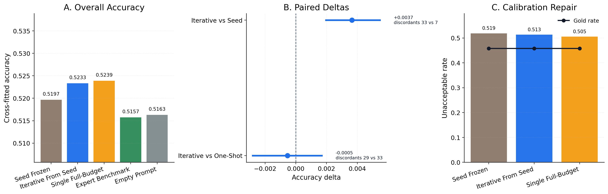
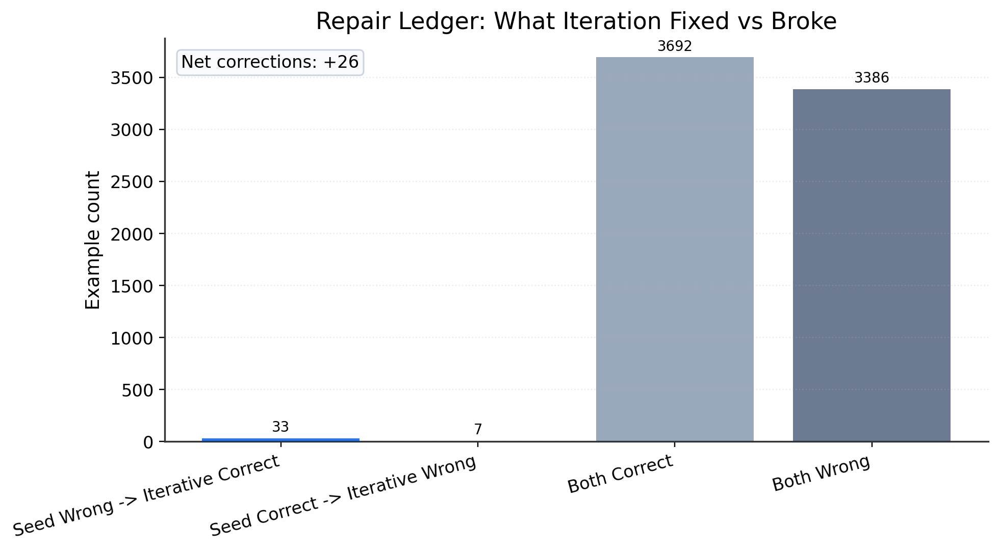
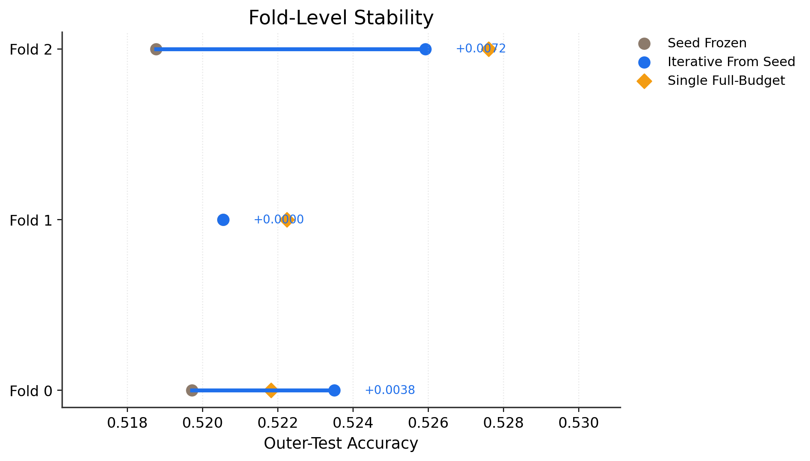

# ETHICS Seed-Repair Deliverable

This repository is a standalone publication-style deliverable for the ETHICS iterative prompt-rewriting project. It packages the completed exploratory publication run centered on the seed-repair claim:

> A strong teacher can iteratively repair a relatively weak frozen seed prompt for a frozen local student under prompt-only constraints and fair controls.

## What Is Included

- Main report: [reports/main/v9_seed_improvement_report.md](reports/main/v9_seed_improvement_report.md)
- Paper PDF: [paper/v9_seed_repair_publication.pdf](paper/v9_seed_repair_publication.pdf)
- Figures and tables: [reports/main/paper_assets](reports/main/paper_assets)
- Exact run config: [configs/publication_compact_flash.yaml](configs/publication_compact_flash.yaml)
- Teacher prompt template: [prompts/teacher_revision_prompt.md](prompts/teacher_revision_prompt.md)
- Teacher manifest summary: [teacher_manifests/summary.json](teacher_manifests/summary.json)
- Aggregate run artifacts: [artifacts](artifacts)
- Bundle metadata: [metadata.json](metadata.json)

## Headline Result

Primary comparison:

- `iterative_from_seed` accuracy: `0.5233`
- `seed_frozen` accuracy: `0.5197`
- Accuracy delta: `+0.0037`
- Bootstrap 95% CI: `[+0.0020, +0.0055]`
- McNemar discordant pairs: `33` vs `7`
- McNemar `p = 4.23e-05`

Interpretation:

- The iterative arm improves over the frozen seed on cross-fitted accuracy.
- The paired test is statistically convincing in this completed exploratory release.
- The improvement is modest in absolute size, so the most defensible framing is targeted seed repair rather than broad expert-level reasoning gains.

## Cross-Fitted Summary

| Arm | Accuracy | Balanced Accuracy | MCC | Predicted Unacceptable | Gold Unacceptable | Signed Bias |
| --- | ---: | ---: | ---: | ---: | ---: | ---: |
| `seed_frozen` | 0.5197 | 0.5214 | 0.0427 | 0.5188 | 0.4577 | +0.0611 |
| `iterative_from_seed` | 0.5233 | 0.5246 | 0.0491 | 0.5132 | 0.4577 | +0.0555 |
| `teacher_single_full_budget_from_seed` | 0.5239 | 0.5245 | 0.0488 | 0.5053 | 0.4577 | +0.0476 |
| `expert_fixed_benchmark` | 0.5157 | 0.5181 | 0.0360 | 0.5258 | 0.4577 | +0.0681 |
| `empty_prompt` | 0.5163 | 0.5131 | 0.0262 | 0.4612 | 0.4577 | +0.0035 |

## Main Visuals

### Seed Repair At A Glance

### Repair Ledger

### Fold Stability

## Recommended Reading Order

1. Read the main report:
   [reports/main/v9_seed_improvement_report.md](reports/main/v9_seed_improvement_report.md)
2. Open the paper PDF:
   [paper/v9_seed_repair_publication.pdf](paper/v9_seed_repair_publication.pdf)
3. Review the asset summary:
   [reports/main/paper_assets/summary.md](reports/main/paper_assets/summary.md)
4. Inspect the two core tables:
   [main results](reports/main/paper_assets/tables/main_results.md)
   and
   [pairwise tests](reports/main/paper_assets/tables/pairwise_tests.md)
