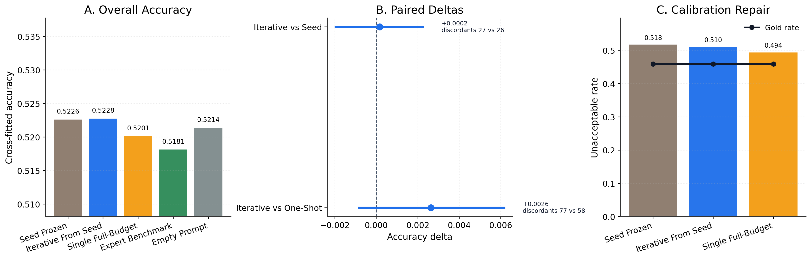
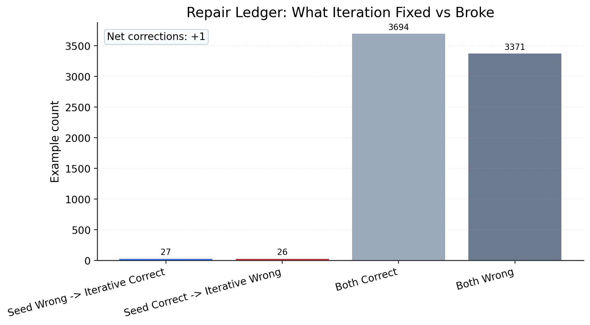
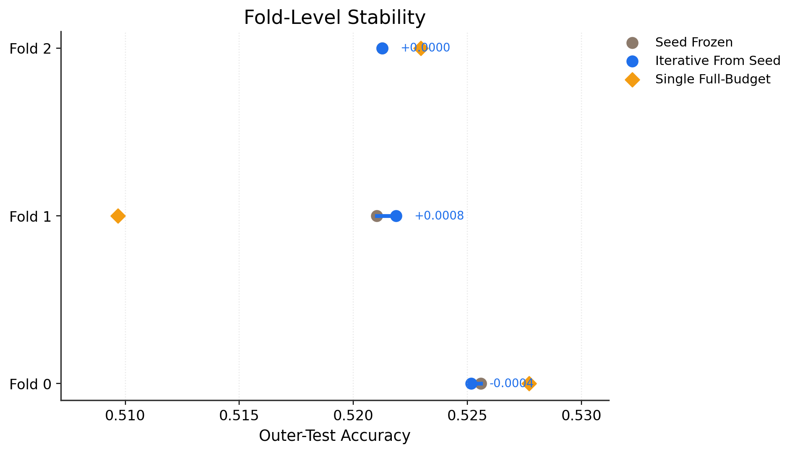

# ETHICS Seed-17 Seed-Repair Deliverable

This repository is a standalone deliverable for the completed `seed=17` exploratory `v9_seed_improvement` run from the ETHICS iterative prompt-rewriting project.

The framing here is narrow and deliberate:

- This is a `seed-17` result package, not the full project history.
- This is an `exploratory_flash` run with `gemini-2.5-flash`, not the final official Pro result.
- The main scientific question is whether `iterative_from_seed` improves over `seed_frozen`.

## What Is Included

- Main report: [reports/exploratory/exploratory_flash_seed_17/v9_seed_improvement_report.md](reports/exploratory/exploratory_flash_seed_17/v9_seed_improvement_report.md)
- Paper PDF: [paper/v9_seed_repair_publication.pdf](paper/v9_seed_repair_publication.pdf)
- Figures and tables: [reports/exploratory/exploratory_flash_seed_17/paper_assets](reports/exploratory/exploratory_flash_seed_17/paper_assets)
- Exact run config: [configs/publication_compact_flash.yaml](configs/publication_compact_flash.yaml)
- Teacher prompt template: [prompts/teacher_revision_prompt.md](prompts/teacher_revision_prompt.md)
- Teacher manifest summary: [teacher_manifests/summary.json](teacher_manifests/summary.json)
- Aggregate run artifacts: [artifacts](artifacts)
- Bundle metadata: [metadata.json](metadata.json)

## Headline Result

The `seed-17` exploratory result is directionally positive but very small.

Primary comparison:

- `iterative_from_seed` accuracy: `0.5228`
- `seed_frozen` accuracy: `0.5226`
- Accuracy delta: `+0.0002`
- Bootstrap 95% CI: `[-0.0020, +0.0022]`
- McNemar discordant pairs: `27` vs `26`
- McNemar `p = 1.0`

Interpretation:

- The iterative arm is numerically above the frozen seed.
- The effect is not statistically convincing in this seed-17 exploratory run.
- This package is therefore useful as a deliverable and documentation artifact, but not as a strong standalone success case.

## Cross-Fitted Summary

| Arm | Accuracy | Balanced Accuracy | MCC | Predicted Unacceptable | Gold Unacceptable | Signed Bias |
| --- | ---: | ---: | ---: | ---: | ---: | ---: |
| `seed_frozen` | 0.5226 | 0.5242 | 0.0483 | 0.5176 | 0.4591 | +0.0584 |
| `iterative_from_seed` | 0.5228 | 0.5238 | 0.0474 | 0.5104 | 0.4591 | +0.0513 |
| `teacher_single_full_budget_from_seed` | 0.5201 | 0.5197 | 0.0393 | 0.4940 | 0.4591 | +0.0348 |
| `expert_fixed_benchmark` | 0.5181 | 0.5201 | 0.0402 | 0.5229 | 0.4591 | +0.0638 |
| `empty_prompt` | 0.5214 | 0.5184 | 0.0369 | 0.4629 | 0.4591 | +0.0038 |

## Main Visuals

The figures below are the quickest way to review the seed-17 outcome.

### Seed Repair At A Glance

### Repair Ledger

### Fold Stability

## Recommended Reading Order

1. Read the main report:
   [reports/exploratory/exploratory_flash_seed_17/v9_seed_improvement_report.md](reports/exploratory/exploratory_flash_seed_17/v9_seed_improvement_report.md)
2. Open the paper PDF:
   [paper/v9_seed_repair_publication.pdf](paper/v9_seed_repair_publication.pdf)
3. Review the asset summary:
   [reports/exploratory/exploratory_flash_seed_17/paper_assets/summary.md](reports/exploratory/exploratory_flash_seed_17/paper_assets/summary.md)
4. Inspect the two core tables:
   [main results](reports/exploratory/exploratory_flash_seed_17/paper_assets/tables/main_results.md)
   and
   [pairwise tests](reports/exploratory/exploratory_flash_seed_17/paper_assets/tables/pairwise_tests.md)

## Important Caveat

This repository intentionally packages only the `seed=17` exploratory deliverable because it was requested as a concrete weekly artifact. It should not be mistaken for the full multi-seed publication record by itself.
