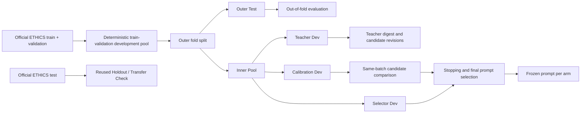

# V9 Design Schematic

## Interpretation

- `teacher_dev` is visible to the teacher.
- `calibration_dev` is used for same-batch candidate ranking.
- `selector_dev` is used only for stopping and final prompt choice.
- `outer_test` is untouched until the prompt is frozen.
- the official test split remains a reused holdout / transfer check and is
  never used during adaptation.
